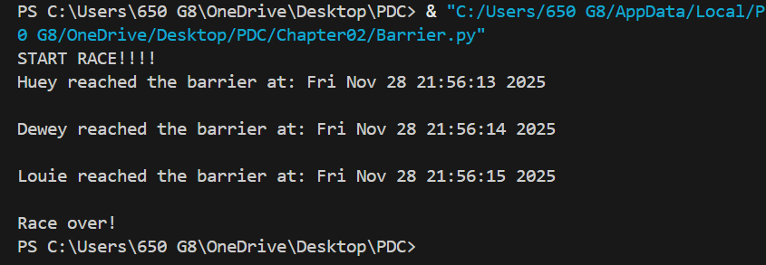
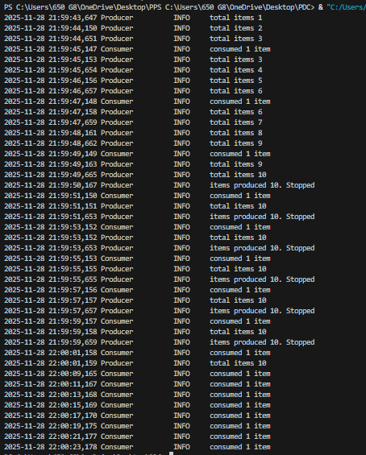
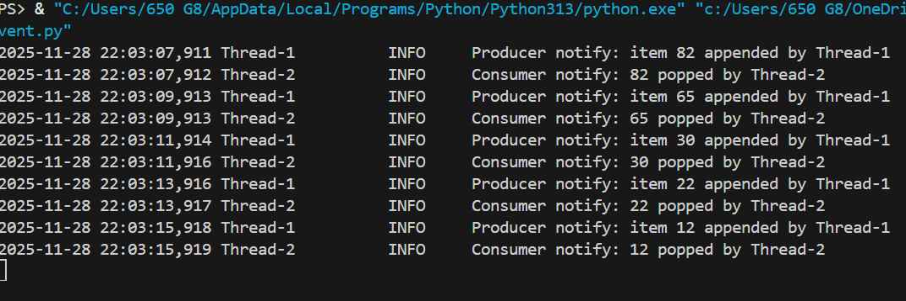
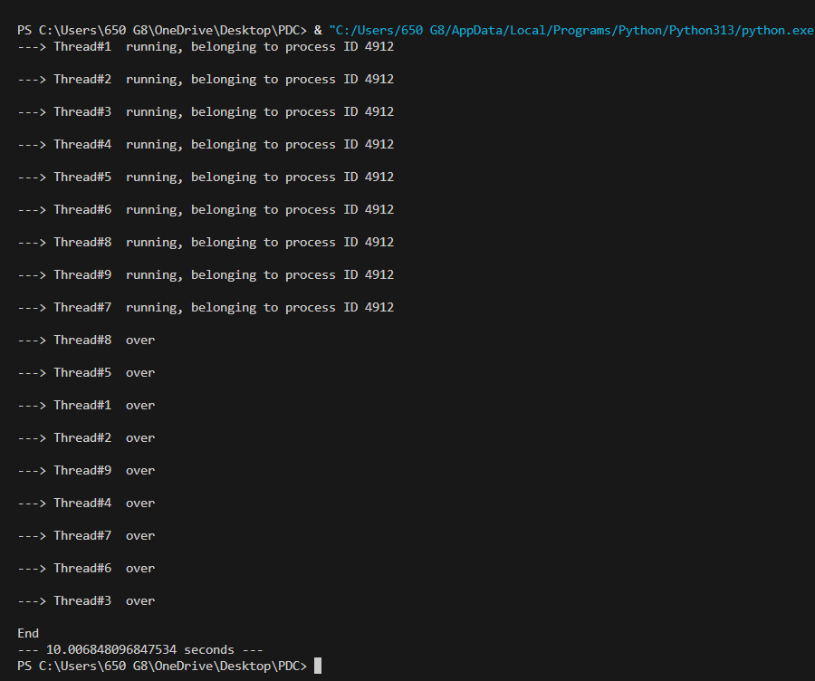
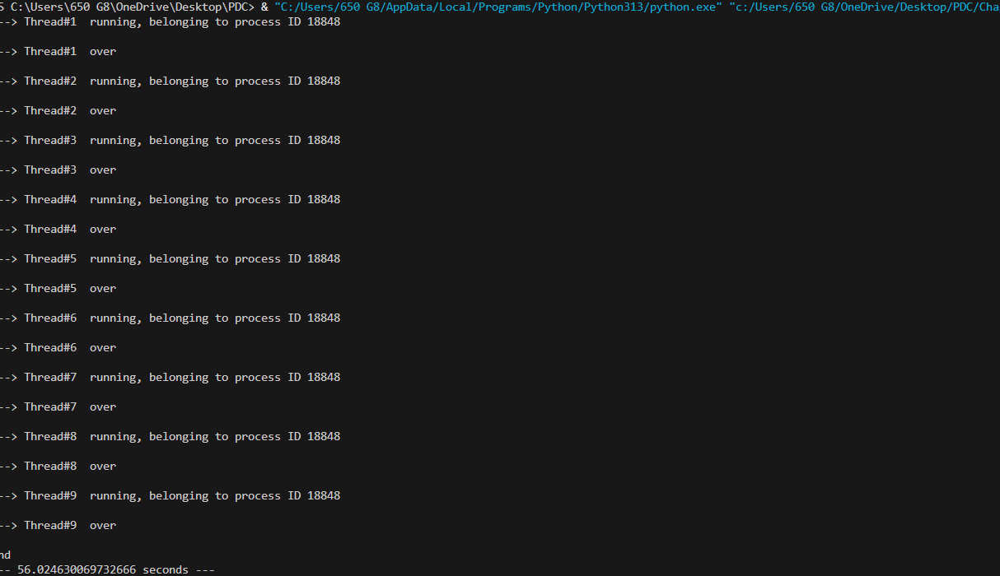
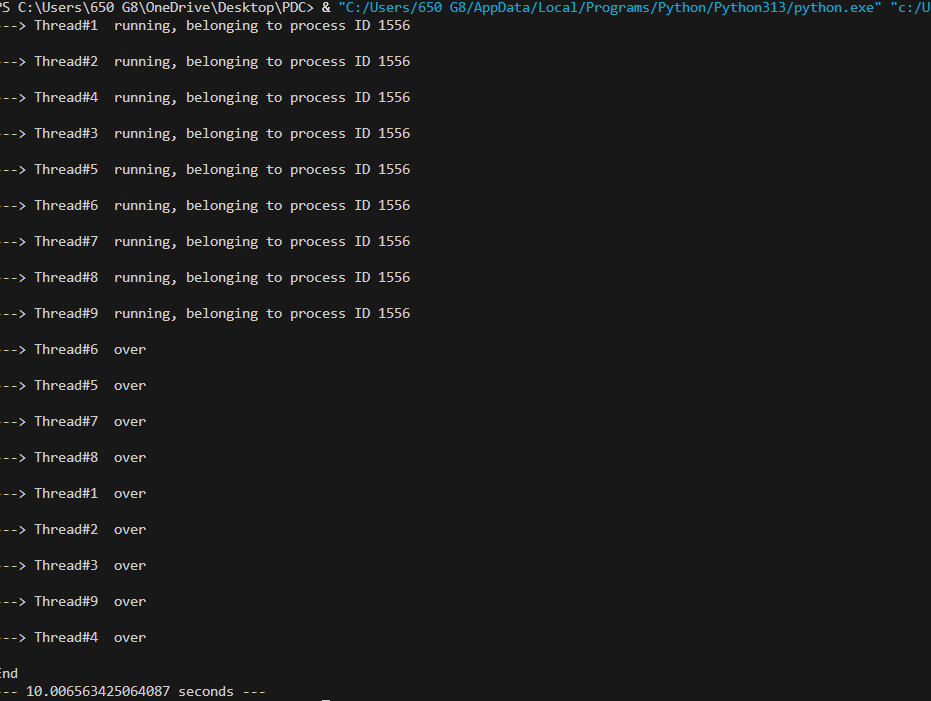
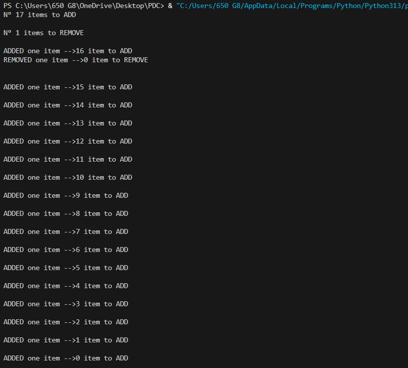
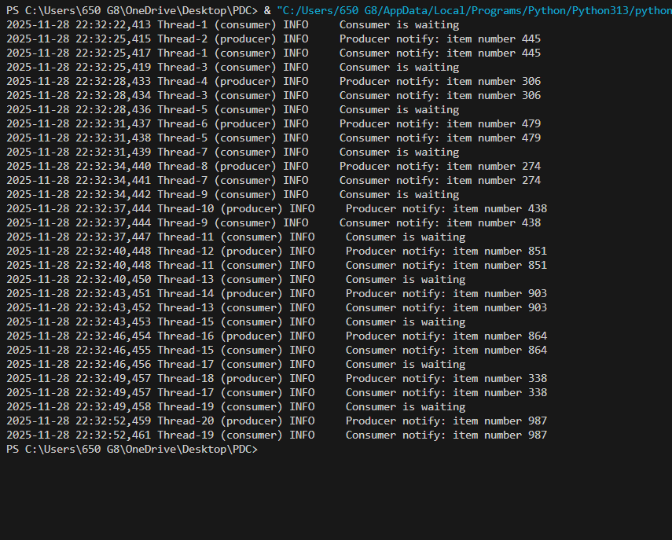

CHAPTER 02 CODES

Barrier:

This code implies a Barrier in Python threads. Three runners (Huey, Dewey, Louie) start concurrently and sleep for a random time. Each runner waits at the barrier (finish_line.wait()), ensuring that all runners reach the barrier before the race ends, synchronizing their execution.

Condition:

This code implies the producer-consumer problem using Python threads and Condition objects. The Producer adds items to a shared list up to a limit, while the Consumer removes items, both waiting and notifying each other to synchronize access. Logging shows the flow, ensuring no race conditions while producing and consuming concurrently.

Event:

This code implies the producer-consumer problem using Python threads and an Event for synchronization. The Producer adds random items to a shared list, signaling the Consumer via event.set(), which then consumes the items. The event.clear() ensures the consumer waits until the next item is produced, avoiding race conditions.

MyThreadClass:

MyThreadClass_Lock:

MyThreadClass_Lock_02:

1. The MyThreadClass code runs multiple threads concurrently without any synchronization, so outputs may interleave.
2. The MyThreadClass_Lock code uses a Lock to synchronize the entire run() method, ensuring only one thread prints at a time.
3. The MyThreadClass_Lock_02 code acquires the Lock only for printing, allowing threads to sleep concurrently, improving parallel execution while keeping outputs orderly.

Rlock:

This code implies the use of a RLock (reentrant lock) in Python threads to safely modify shared data (total_items) concurrently. The adder thread increases items, while the remover thread decreases them, both using the same lock to prevent race conditions. Reentrant locking allows a thread to acquire the lock multiple times within nested method calls.

Semaphores:

This code implies the use of a Semaphore in Python threads to synchronize a producer-consumer scenario. The consumer waits until the producer produces an item and calls semaphore.release(). This ensures that the consumer only proceeds after the producer has made data available, preventing race conditions.