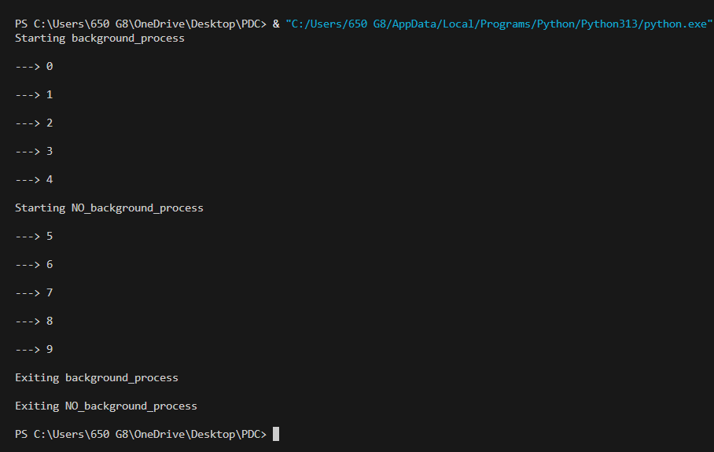
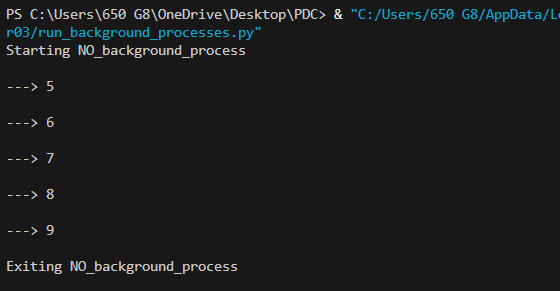
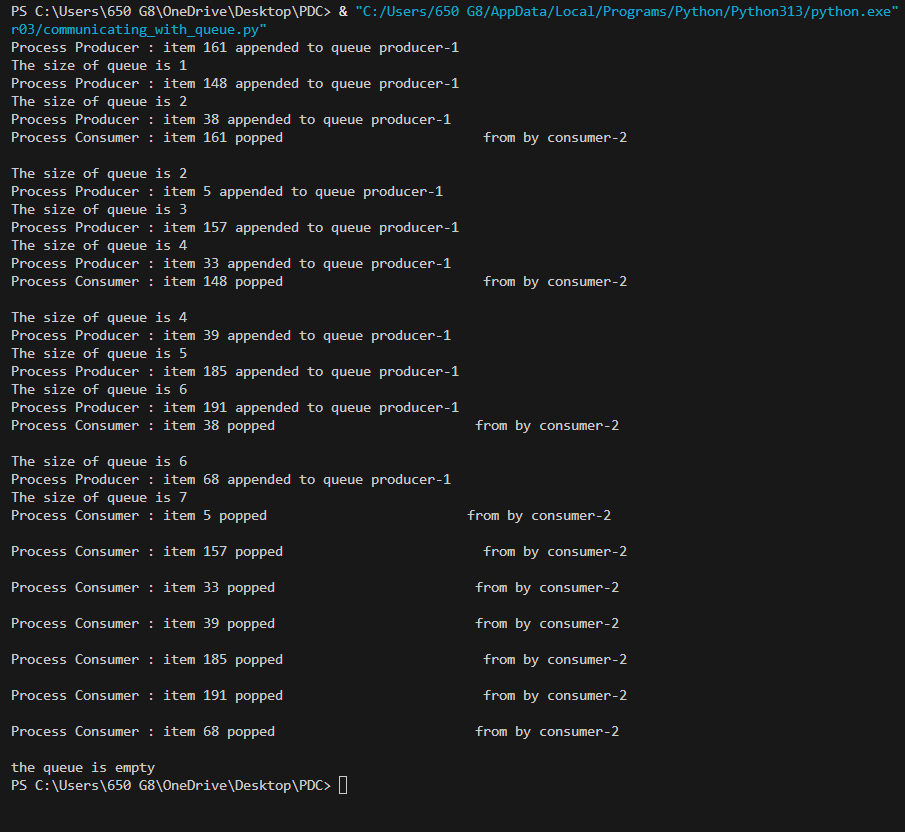
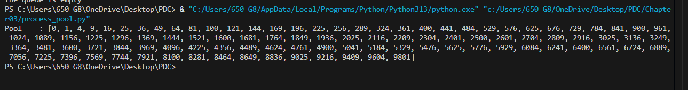
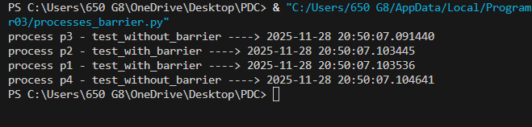
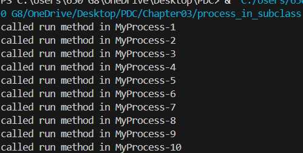

# Chapter 03

Killing Processes:

Processes may need to be killed to free system resources, avoid hangs, and keep the system running smoothly. terminate() stops a process instantly, while is_alive(), exitcode, and join() help monitor and clean up after it. An exit code of 0 means success, a positive value shows an error, and a negative value indicates termination by a signal.

Naming Processes:

Naming processes improves debugging, clarity, and log readability when working with multiple processes. You can assign custom names using the name parameter and retrieve them inside the target function with current_process().name. After naming, simply start and join the processes to run and synchronize them.

Spawning Processes:

Spawning a process means creating a child process that runs independently of the parent. The parent can continue execution or wait for the child using join(). A process is spawned by defining it with multiprocessing.Process, starting it with start(), and synchronizing with join().

Run_Background_Processes:

Background processing lets tasks run without user interaction, often as daemons in Unix/Linux or system-tray processes in Windows. In Python, daemon=True creates background processes that end automatically with the parent, while daemon=False makes them independent. Daemon processes are useful for lightweight tasks but cannot spawn child processes and inherit their daemon state from the parent.

Pipe Processes:

A Pipe in multiprocessing allows communication between two processes, either one-way or bidirectional. Using multiprocessing.Pipe(duplex=True), you get two connected Connection objects for sending and receiving data. Pipes are useful for exchanging data directly, such as sending numbers from one process for processing in another.

Queue Processes:

A Queue in multiprocessing is a FIFO structure used to safely exchange data between processes, commonly solving producer-consumer problems. Producers put data in the queue while consumers retrieve and process it, helping avoid deadlocks. JoinableQueue adds task_done() and join() methods to track and wait for all tasks to complete.

Process_Pool:

A process pool lets you run the same function on multiple inputs in parallel, enabling data parallelism. Methods like apply() and map() are blocking (synchronous), while apply_async() and map_async() are non-blocking, allowing background execution. map() and map_async() efficiently distribute multiple inputs across processes for parallel computation.

Processes_Barrier:

A Barrier synchronizes multiple processes by dividing a program into phases. All processes must reach the barrier before any can proceed. Code after the barrier runs only once all processes have completed the preceding phase.

Process_In_Subclass

A subclass inherits properties and methods from a superclass, allowing reuse and customization. It can override methods to provide specific behavior. In multiprocessing, overriding the run(self) method defines the code executed when the process starts, such as printing the process name.

