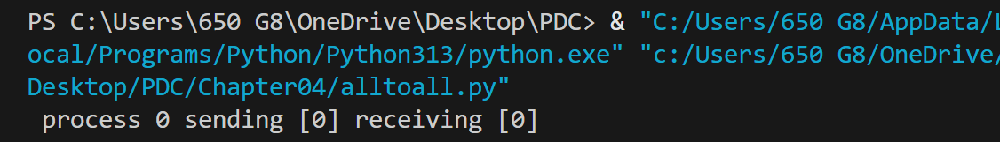
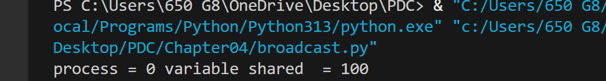
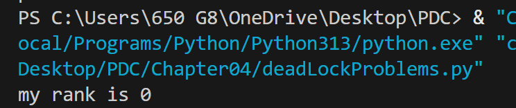
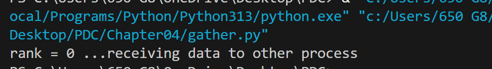
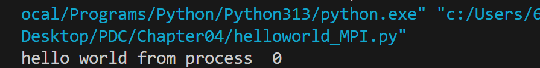
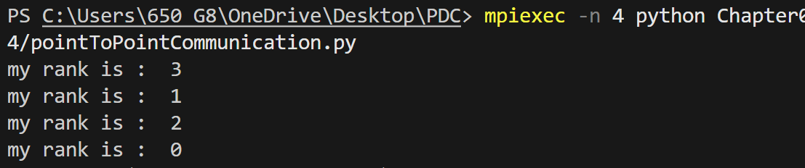
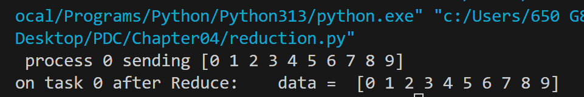
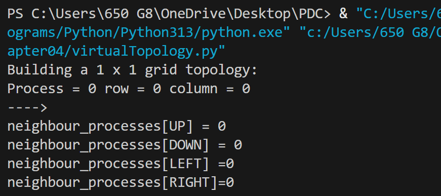

# Chapter04
alltoall:

Alltoall is an MPI collective operation that combines both scatter and gather. Every process sends a portion of its data to every other process, and also receives a portion from every process. This makes it useful for algorithms that require global data redistribution, such as FFT, matrix transpose, and sample sort.

Broadcast:

Broadcasting in MPI allows one root process to send the same data to all other processes in the communicator.
It is a collective communication operation involving multiple processes simultaneously.
Useful when every process needs identical input, such as configuration values or initial data.

DeadLockProblems:

Deadlock occurs when two or more processes are stuck waiting for each other and none of them can proceed.
It usually happens when each process holds a resource and waits for another resource held by another process.
As a result, all processes involved stop forever, causing the program to freeze.

Gather:

Each process prepares a value (send_value) which is its rank.
comm.gather() sends every process's value to the root process (rank 0).Only root receives the full list data, e.g., [0,1,2,3,...], while others get None.

helloworld_MPI:

The program first connects all MPI processes using COMM_WORLD and then each process gets its own unique rank with Get_rank(). After that, every process prints “hello world from process X”, so when you run it with multiple processes, each one prints the same message but with a different rank.

pointToPointCommunication:

This program sends data between specific MPI processes, where each pair communicates independently.
Process 0 sends a number to process 2, and process 1 sends a string to process 3.Processes 2 and 3 simply receive their messages and print them, ensuring smooth, deadlock-free communication.

Reduction:

This code creates an integer array senddata in each MPI process based on its rank and a zero array recvdata to store results. Using comm.Reduce with MPI.SUM, all senddata arrays are summed across processes and the result is stored in recvdata on the root process (rank 0). When printing, only the root process shows the combined sum, while other processes’ recvdata remains zero.

Scatter:

This code attempts to use scatter to distribute data from the root process to all processes. However, comm.scatter expects the root to provide a list of elements for each process, not a single list. Here’s what it does conceptually: the root process (rank 0) has an array, and scatter is supposed to send one piece of it to each process, storing it in recvbuf. Each process then prints the value it received.

VirtualTopology:

This code sets up a 2D Cartesian grid topology for MPI processes and finds each process’s neighbors. Each process is placed in a grid of size close to the square root of total processes, and Create_cart defines a periodic (wrap-around) grid. Using Shift, each process identifies its up, down, left, and right neighbors, and then prints its rank, grid coordinates, and neighboring process ranks.

