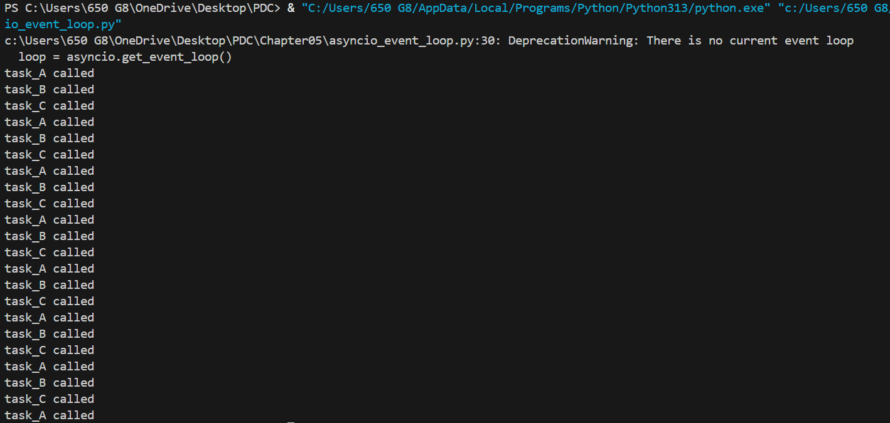

asyncio_event_loop:

This program uses an event loop with scheduled callbacks (call_later, call_soon) to repeatedly run three tasks (A → B → C → A → …). Each task prints its name, sleeps for a random time, and then schedules the next task to run 1 second later. The loop keeps cycling through the three tasks for 60 seconds, after which the event loop stops.

