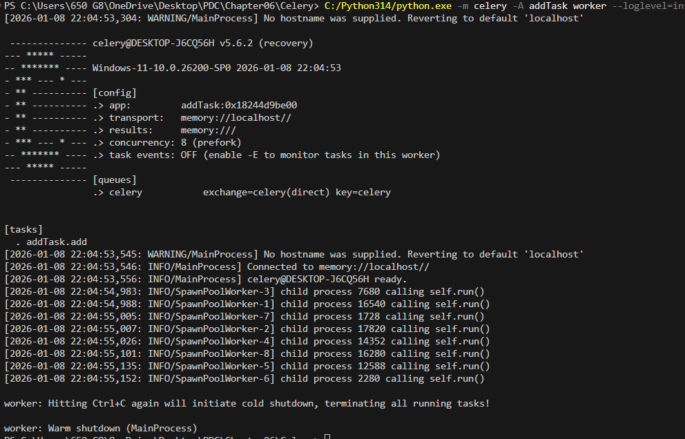

# Chapter06
# Celery

addtask_main.py AND addTask.py:

This code uses Celery to execute an addition task asynchronously in the background.
A Celery worker receives the task from the main program, processes it using a memory-based broker, and executes the function.The main program waits for the task to complete and then retrieves and prints the result.