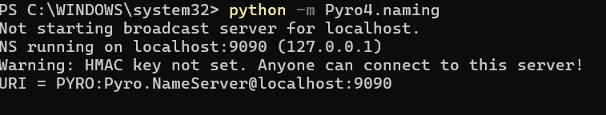
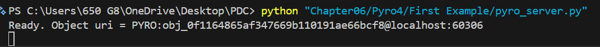
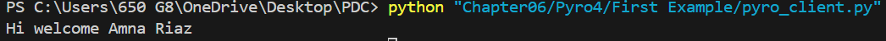
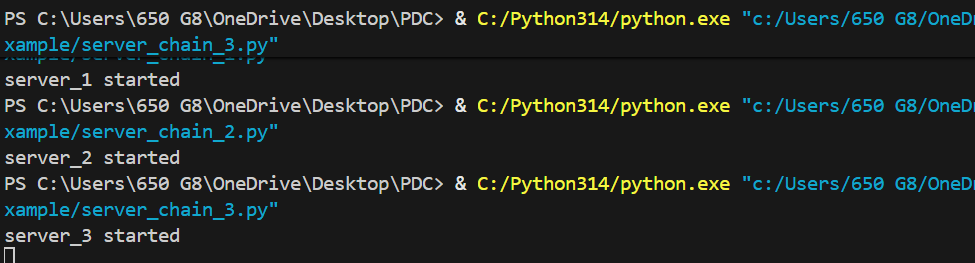

# Chapter06
# Pyro4 and Socket

First Exmaple:

The Pyro4 client script prompts the user for their name, connects to the Pyro4 server via the name server, and prints a personalized welcome message.

Second Example:

Pyro4 (Python Remote Objects): A library for distributed object communication. The first example shows a client connecting to a server via a name server to get a personalized welcome message. The second example implements a chain topology where three servers pass messages in a loop (1→2→3→1), demonstrating remote method calls and object proxying.

Celery: An asynchronous task queue system. The example uses Celery to execute an addition task in the background with a worker process. The main program submits the task asynchronously and waits for the result, showcasing distributed task processing with a memory-based broker.

Socket Programming: Low-level network communication using Python's socket module. The server example creates a TCP socket, binds to port 9999, listens for connections, and sends the current time to clients upon connection, illustrating basic client-server socket communication.