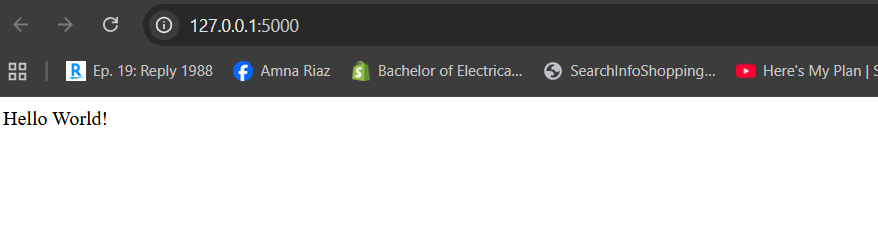
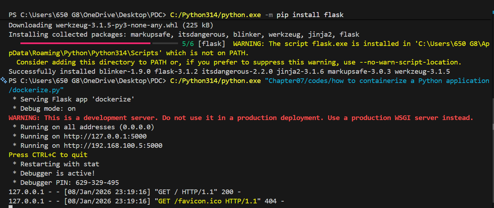

# Chapter07
 Docker:

This Python script creates a minimal Flask web application. It imports Flask, initializes an app instance, defines a root route ("/") that returns "Hello World!", and runs the server on all interfaces at port 5000 with debug mode enabled. The application is designed for containerization, as indicated by the accompanying Dockerfile and requirements.txt.